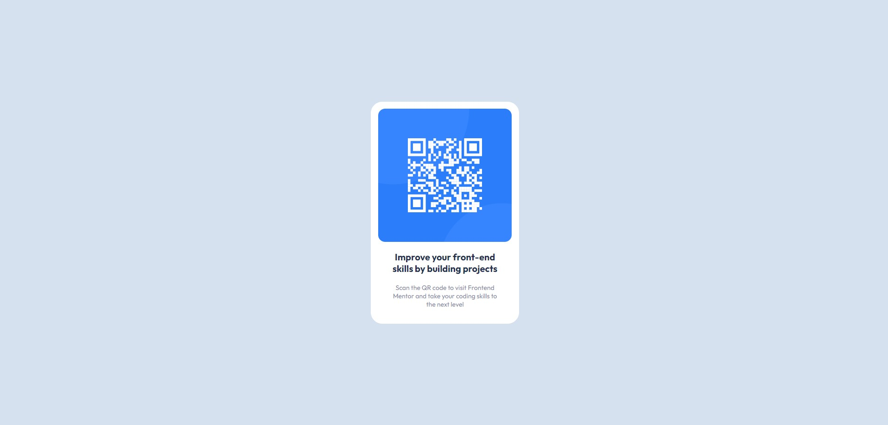

# Frontend Mentor - QR code component solution

This is a solution to the [QR code component challenge on Frontend Mentor](https://www.frontendmentor.io/challenges/qr-code-component-iux_sIO_H). Frontend Mentor challenges help you improve your coding skills by building realistic projects. 

## Table of contents

- [Overview](#overview)
  - [Screenshot](#screenshot)
  - [Links](#links)
  - [Built with](#built-with)
  - [Useful resources](#useful-resources)
- [Author](#author)

**Note: Delete this note and update the table of contents based on what sections you keep.**

## Overview

### Screenshot

### Links

- Solution URL: [Solution](https://www.frontendmentor.io/solutions/qr-component-using-padding-and-border-radius-with-a-bit-of-font-css-IrBrFHDvWs)
- Live Site URL: [Live Site](https://ryoliveira.github.io/QR-component/)

### Built with

- CSS custom properties
- [Vite](https://vitejs.dev/) - Frontend dev tool
- [Vue](https://vuejs.org/) - JS Framework

### What I learned

Css Resets are a good way to set a base for all css so that its consitant between browsers.
Use Margins to create space between elements.
Avoid useing px when possible. rem is the way to go.

### Useful resources

- [Google Fonts](https://fonts.google.com/) - Useful to find free fonts for challenges

## Author
- Frontend Mentor - [@Ryoliveira](https://www.frontendmentor.io/profile/Ryoliveira)

